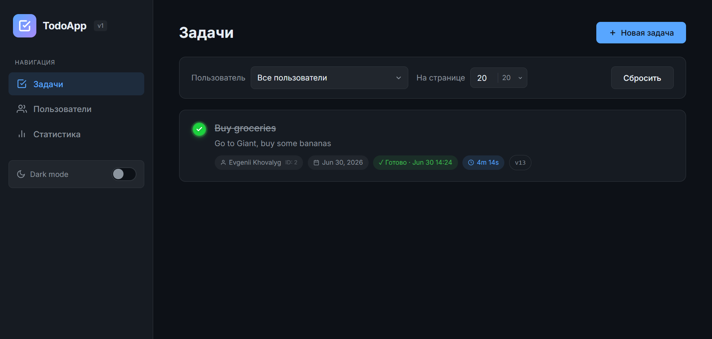

# 📋 ToDo List — Техническое задание

> Разработка полноценного REST API-приложения для управления задачами с поддержкой пользователей и аналитики.

---

## 🛠 Технологический стек

| Категория | Технология |
|---|---|
| 🔧 Контроль версий | Git |
| 🐹 Язык разработки | Golang |
| 🌐 API | REST API |
| 🗄 База данных | PostgreSQL |
| 🔄 Миграции | Database Migrations |
| 🌍 Конфигурация | Переменные окружения |
| 📝 Мониторинг | Логгирование |
| ⚙️ Сборка | Makefile |
| 🐳 Контейнеризация | Docker + Docker Compose |

---

## ✨ Функциональные требования

### 1. 👤 Управление пользователями

> CRUD REST API для работы с пользователями. Авторизация и аутентификация **не требуются**.

#### Доступные операции

| Операция | Описание |
|---|---|
| `POST` | Создать пользователя |
| `GET` | Получить одного пользователя |
| `GET` | Получить список с опциональной пагинацией |
| `PATCH` | Изменить ФИО / номер телефона |
| `DELETE` | Удалить пользователя |

#### Валидация полей

**ФИО**
- ✅ Обязательное поле
- 📏 Минимум: **3 символа**
- 📏 Максимум: **100 символов**

**Номер телефона**
- ⬜ Опциональное поле
- 📏 Минимум: **10 символов** (если указан)
- 📏 Максимум: **15 символов** (если указан)
- 🔢 Начинается с **`+`**, содержит только цифры

---

### 2. ✅ Управление задачами

> CRUD REST API для работы с задачами. Каждая задача привязана к существующему пользователю-автору.

#### Доступные операции

| Операция | Описание |
|---|---|
| `POST` | Создать задачу |
| `GET` | Получить одну задачу |
| `GET` | Получить список с опциональной пагинацией |
| `GET` | Получить задачи конкретного пользователя |
| `PATCH` | Изменить заголовок / описание / поле `completed` |
| `DELETE` | Удалить задачу |

#### Валидация полей

**Заголовок**
- ✅ Обязательное поле
- 📏 Минимум: **1 символ**
- 📏 Максимум: **100 символов**

**Описание**
- ⬜ Опциональное поле
- 📏 Минимум: **1 символ** (если указано)
- 📏 Максимум: **1000 символов** (если указано)

**Поле `completed`**
- ✅ Обязательное поле (булево значение)

**Поле `created_at`**
- ✅ Обязательное поле
- 🔒 Только для чтения — выставляется **автоматически** при создании записи в БД

**Поле `completed_at`**
- ⬜ Опциональное поле
- 🔒 Управляется приложением автоматически

#### Бизнес-правила для `completed`

```
completed == true   →   completed_at IS NOT NULL
                        completed_at >= created_at

completed == false  →   completed_at IS NULL
```

---

### 3. 📊 Статистика по задачам

> Аналитический эндпоинт с гибкой фильтрацией.

#### Фильтры

- 🌐 **По всей системе** — общая статистика
- 👤 **По конкретному пользователю** — персональная статистика
- 📅 **За временной промежуток** — статистика за период

#### Метрики

| Метрика | Описание |
|---|---|
| 📌 Всего задач создано | Общее количество задач |
| ✅ Всего задач выполнено | Количество завершённых задач |
| 📈 Процент выполнения | `выполнено / создано × 100%` |
| ⏱ Среднее время выполнения | Среднее значение `completed_at - created_at` |

---